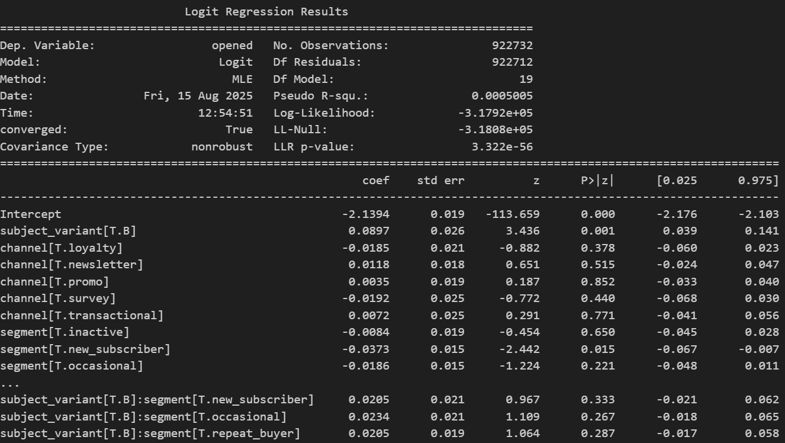
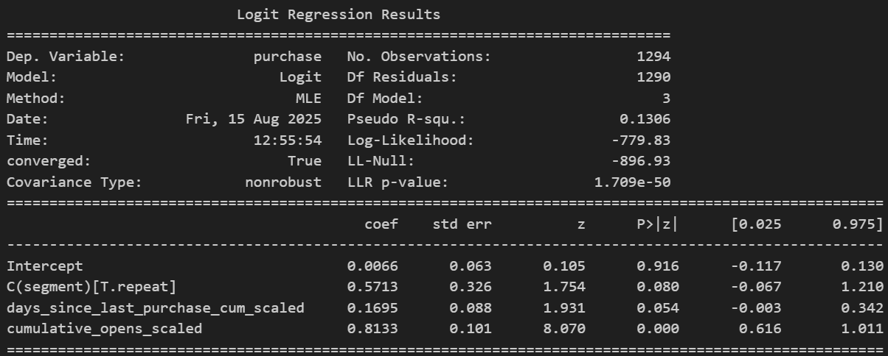
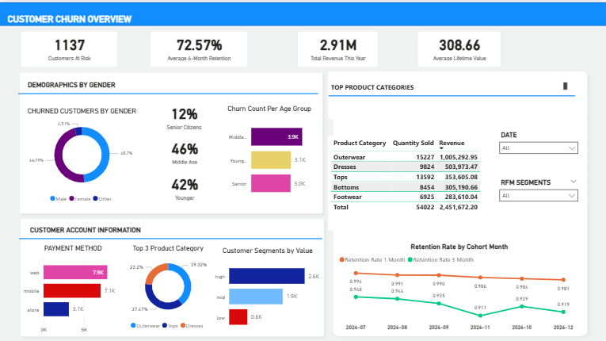
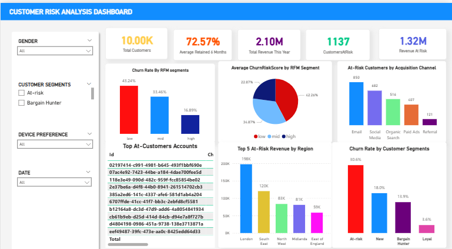
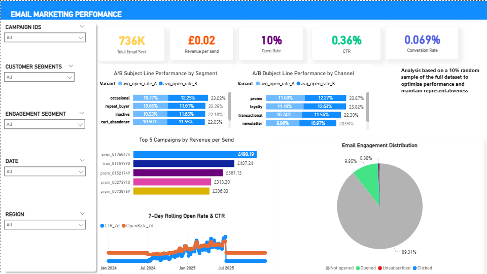

# Operations & CRM Performance Dashboard with Retention Analysis

End-to-end CRM analytics using historical eCommerce and email marketing data to analyze customer behavior, identify retention drivers, measure churn, and evaluate email engagement. Includes automated Python analysis pipelines, logistic and linear modeling, and interactive Power BI dashboards for actionable retention and cohort insights.

## Table of Contents
1. [Descriptive Analysis Questions](#descriptive-analysis-questions)  
2. [Exploratory Analysis Questions](#exploratory-analysis-questions)  
3. [Retention Cohort Analysis](#retention-cohort-analysis)  
4. [Results and Analysis Summary](#results-and-analysis-summary)  
5. [Key Findings & Conclusion](#key-findings--conclusion)  
6. [Screenshots](#screenshots)  
7. [Usage Instructions](#usage-instructions)  
8. [Future Work](#future-work)

---

## Descriptive Analysis Questions

| # | Question | Sub-questions |
|---|----------|---------------|
| 1 | Order & Fulfillment Overview | Daily, weekly, monthly order volumes; average fulfillment cycle time; OTD%; return rate by product category/month |
| 2 | Inventory & Returns | Inventory fluctuation relative to order peaks |
| 3 | High-Level CRM Descriptives | Open rate, CTR, unsubscribe by channel; by customer segment; by age group and region |

---

## Exploratory Analysis Questions

| # | Question | Sub-questions |
|---|----------|---------------|
| 1 | Subject Line A/B Performance | Statistically significant differences in open rate between variants; segment/channel consistency |
| 2 | Timing & Frequency Effects | Send time effects on open/CTR; engagement fatigue impact on unsubscribe/purchase |
| 3 | Segment-Level Insights | Segment response to promotions vs newsletters; purchase frequency vs email engagement; next-30-day order rate and AOV uplift |

---

## Retention Cohort Analysis

| # | Question | Sub-questions |
|---|----------|---------------|
| 1 | Subject Line A/B Performance | Open rate changes within cohorts; persistence across cohort ages |
| 2 | Timing & Frequency Effects | Send time effects within cohorts; engagement fatigue influence on cohort unsubscribe/repurchase |
| 3 | Segment-Level Insights | Cohort and RFM segments showing strongest retention/LTV; treatment rules for promotional cadence |

---

## Results and Analysis Summary

### Churn Analysis by RFM Segment
- Low-Value: 13.9%, Mid-Value: 14.7%, High-Value: 15.1%  
- Differences measurable; targeted retention needed

### Cohort Retention Analysis
- Early cohorts show inflated retention; later cohorts limited by incomplete observation windows  
- Retention stabilizes after initial growth; complete data required for long-term estimates

### Subject Line A/B Performance (Python)
- Two-proportion z-test: Z = -32.86, p ≈ 0; Variant B +0.9 pp over A  
- Channel effects exceed subject effects  
- Segment interactions mostly insignificant

### Logistic Regression: Unsubscribe
- Days since last purchase: negative effect  
- Cumulative opens: positive effect  
- Segment type: not significant

### Logistic Regression: Purchase
- Cumulative opens: positive strong effect  
- Repeat customer: positive significant effect  
- Days since last purchase: non-significant

### Purchase Frequency and Email Engagement
- Higher frequency → higher revenue and engagement  
- Associational analysis; causation not established

### Impact of Engagement on Next-30-Day Orders & AOV
- Engaged: 1.44% vs Non-engaged: 0.79%  
- AOV slightly lower for engaged (£35.60 vs £36.03)  
- Engagement predicts repeat purchases

---

## Key Findings & Conclusion

- Variant B +0.9 pp open rate; statistically significant, small effect  
- Channel strategy more important than subject variant  
- Cumulative opens predict purchase/unsubscribe  
- Repeat customers more likely to purchase  
- Time-of-send effects noisy; coefficients directional, not prescriptive  
- Six-month churn ~14–15% across RFM; high-value marginally higher  
- Correct cohort censoring/timestamp quality before automated campaigns

---

## Screenshots

**Python Analysis**  

  
*Logistic regression coefficients and significance levels for key predictors affecting churn, purchase probability, and unsubscribe behavior. Highlights variables with meaningful directional impact.*  

  
*Comparison of RFM (Recency, Frequency, Monetary) segments between new and repeat customers. Shows differences in purchase behavior and engagement across segments.*  

  
*Summary of logistic regression models predicting purchase and unsubscribe outcomes. Demonstrates the effect of cumulative engagement and customer type on purchase likelihood and unsubscribe risk.*

**Power BI Dashboard** 
See Power-BI tab **Business Translation & Key Insights** for consolidated key insights and conclusions relevant to business decisions. This tab summarizes performance trends, customer risk, and actionable recommendations based on CRM and retention analysis.  

  
  

---

## Usage Instructions
1. Clone the repository  
2. Use the cleaned CSV datasets in data/ folder
4. Execute notebooks in `notebooks/` for analysis & model training  
5. Export datasets to `powerbi/` and open `.pbix` files  

---

## Future Work
- Survival and uplift models for targeting  
- Robust timestamp validation & censoring  
- Experiment power calculations & automated A/B reporting  
- Campaign-level cost & margin analysis

